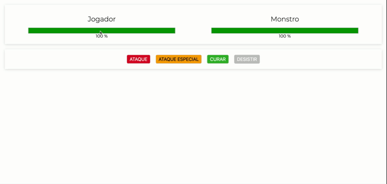

# Curso Vue
Curso da Udemy: <https://www.udemy.com/course/vue-js-completo/>

VueJS é um framework Javascript fantástico p construir aplicações Frontend! Vue.js mistura o melhor do Angular + React!

# Projeto 01 - Matador de Monstros

👤 **Roberta Soares**

* Github: [@Rosooares](https://github.com/rosooares)
* Linkedin: [@Rosooares](https://www.linkedin.com/in/robertassoares/)